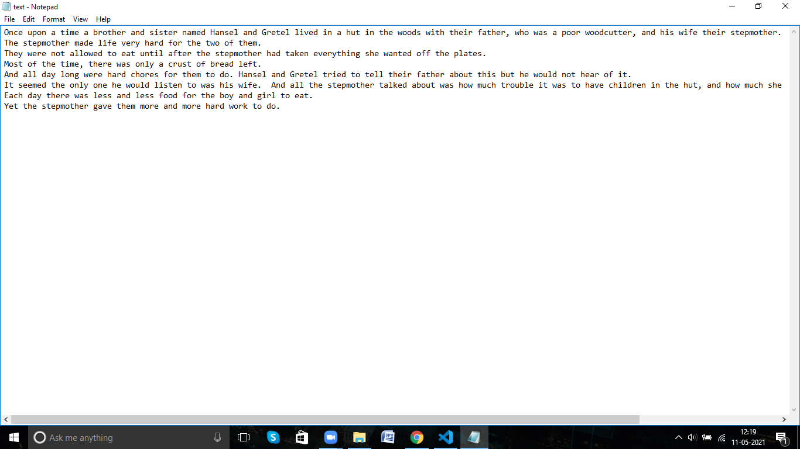
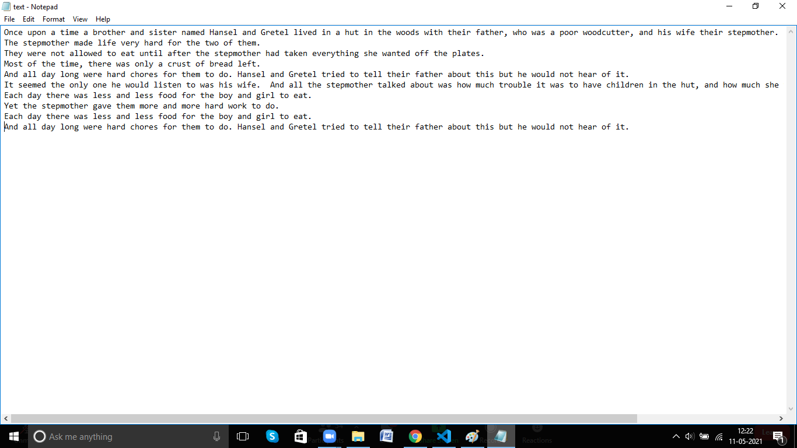

# Word Prediction

## Using Natural Language Processing

Let us start by introducing the main files required and the libraries needed to be installed

### Files introduction

* NLP word processing.ipynb : Model training and development; also has the reference to the training dataset and can be used to make changes to the model
* book.txt : Main dataset used to train the model
* book_clean.txt : Intermediate file used in the creation of the model
* cudart64_110.dll : Script used to run the tensorflow application
* text.txt : File used to test and model and get the output
* tokenizer.p : Script used to run the tokenizer function of the keras package
* model.h5 : Model after compiling and saving and is referenced to use it at once
* wordcreate.py : Actual file to run to get the output

### Libraries used:

* numpy
* keras
* string
* pickle

### Output

The story of a minimum of 2 lines and 50 words are provided to the algorithm. The algorithm breaks them into tokens and runs using the model to genrate output. The output is thereafter added to the same file and in the next run becomes a part of the story introduction.

The last two lines of the story was genrated using the algorithm and the output is very well in lines with the concept of the story. This can be verified by referring to the actual story. 

Link for actual story [here](https://storiestogrowby.org/story/hansel-and-gretel-bedtime-stories-for-kids/)

